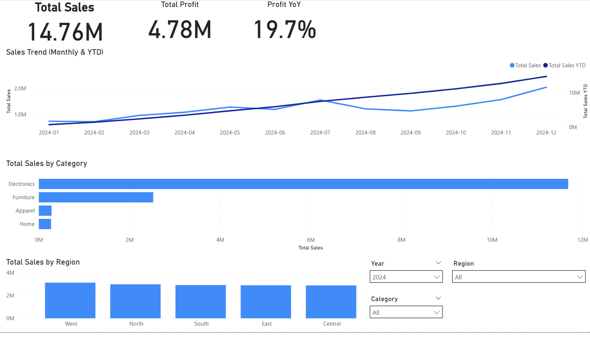
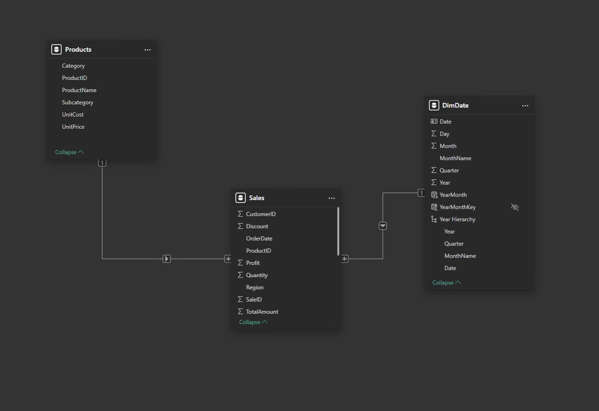

# Power BI Sales Dashboard

Interactive sales dashboard built in Power BI with a star schema data model, DAX time intelligence, and management-ready KPIs.

## 📊 Dashboard Preview

## 🧩 Data Model (Star Schema)

## 🔧 Tech Stack
- Power BI Desktop
- Power Query (ETL)
- DAX
- Star Schema (Fact / Dimension model)

## 📈 Key Metrics
- Total Sales
- Total Profit
- Sales YTD
- Sales YoY %
- Profit YoY %

## 🧠 Business Questions Answered
- How are sales evolving over time (monthly and YTD)?
- How do current sales compare to the previous year (YoY)?
- Which product categories generate the most revenue?
- How do sales and profit differ by region?
- How do filters (Year, Category, Region) impact overall performance?

## 🛠 Key Features
- Custom Date dimension (DimDate)
- Time intelligence measures (YTD, PY, YoY)
- Interactive slicers (Year, Category, Region)
- KPI cards for management overview
- Clean and intuitive dashboard layout

## 📁 Files in this Repository
- `Sales_Dashboard.pbix` — Power BI report
- `db1.jpg` — dashboard screenshot
- `db2.jpg` — data model (star schema)
